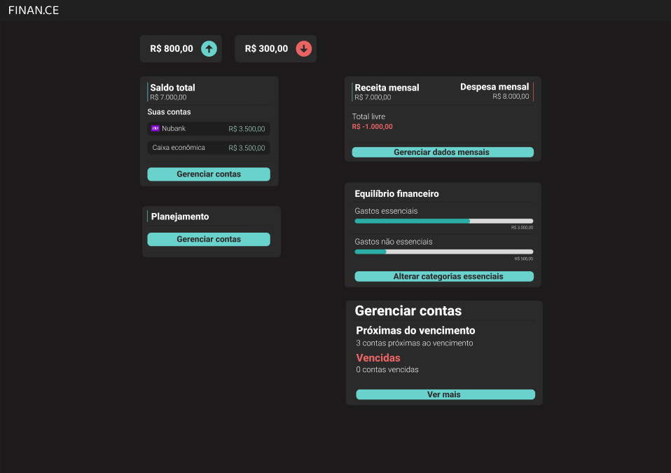
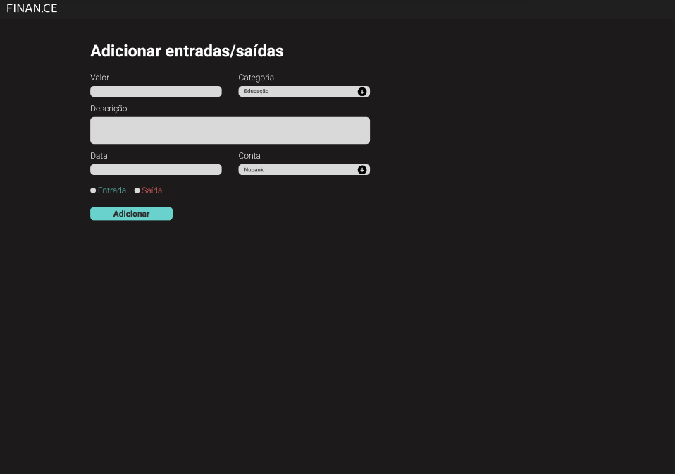
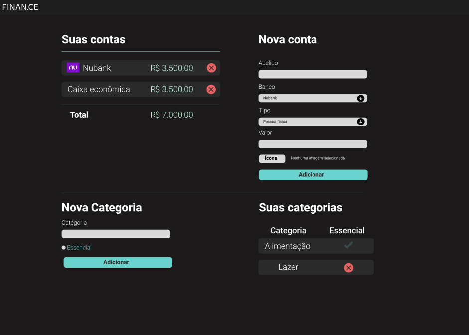
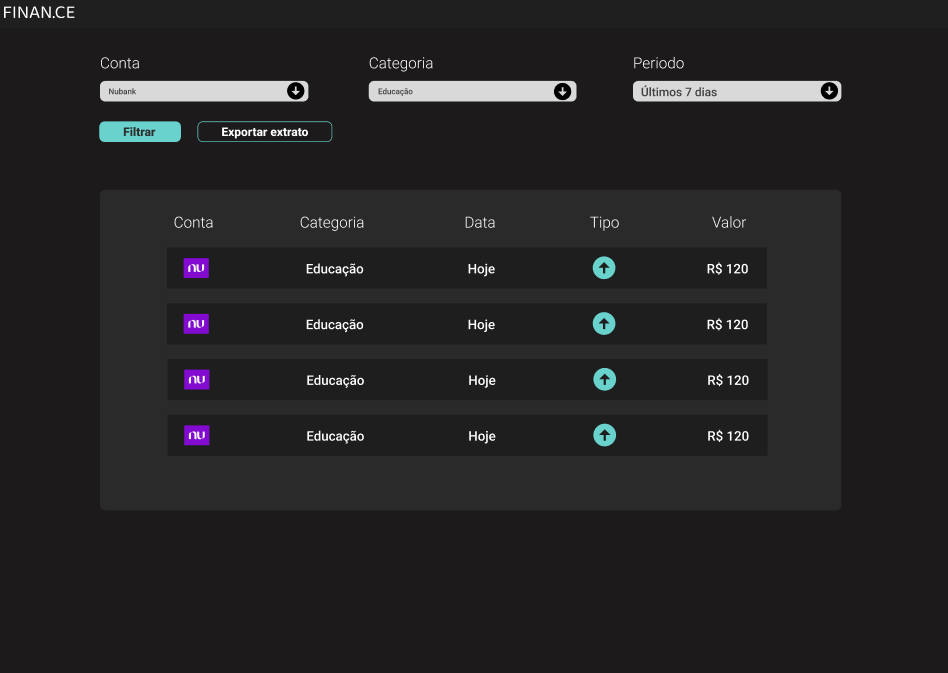
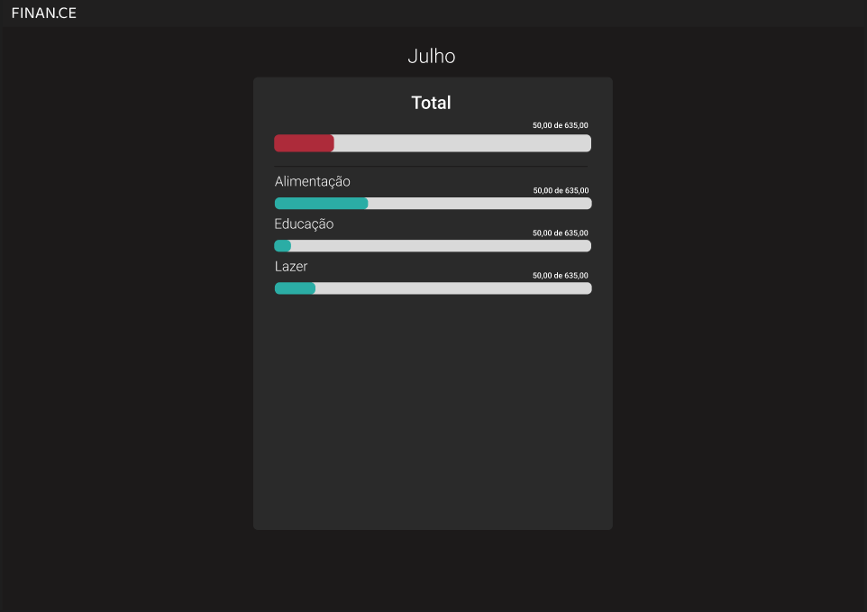
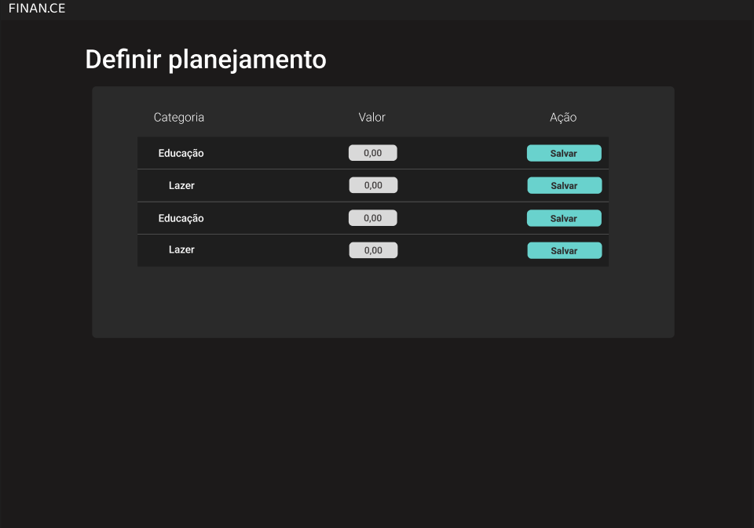
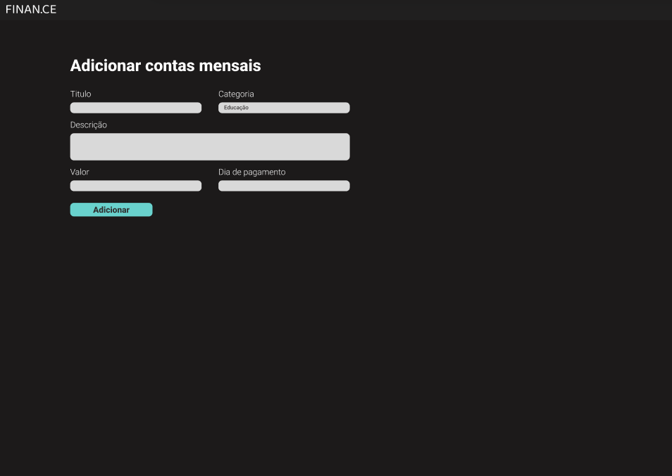
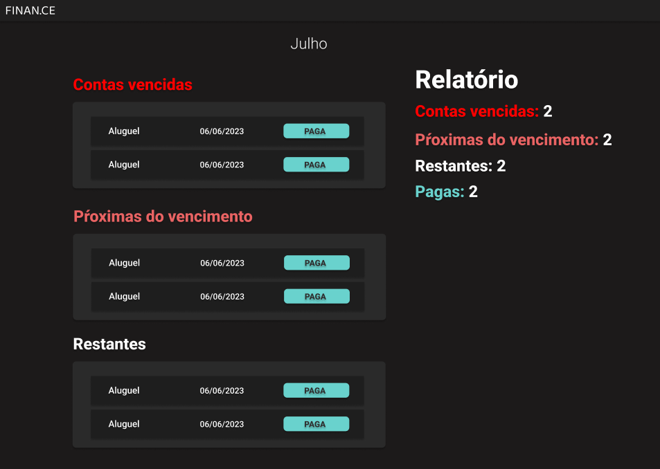
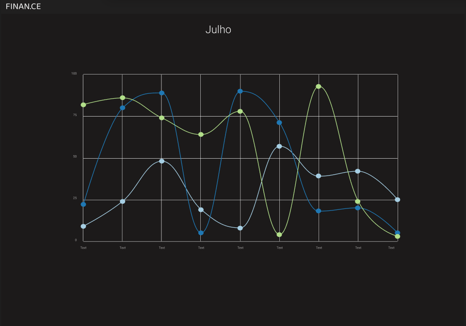

# AD.PET

Aplicação feita para adoção de animais


# Sobre o projeto

Este projeto é uma aplicação full stack web com foco em backend utilizando Django. 
A aplicação consiste em um sistema que permite com que o usuario possa organizar suas finanças de forma simples e organizada, controlando a saida e entradas em suas diversas contas assim como tambem manter um controle de suas futuras contas e contas vencidas.

# Layout Web
## Home da Aplicação

<div>

</div>

## Controle de contas e saldo
<div>

</div>

## Adição de entradas e saidas de dinheiro
<div>

</div>

## Filtro/extrato de entradas e saidas
<div>

</div>

## Controle dinamico de valores
<div>

</div>

## Planejamento de gastos
<div>

</div>

## Adição de contas para controle
<div>

</div>

## Controle de contas com relatório
<div>

</div>

## Dashboard
<div>

</div>

# Tecnologias utilizadas
## Back end
- Python
- Django
## Front end
- HTML
- CSS
- JavaScript
- Bootstrap
## Banco de Dados
- SQLite

# Como executar o projeto

## Pré-requisitos
Python 3

## Clonar repositório
https://github.com/Leonardondm/Finance

## Instalar dependências 
```
pip install django
pip install pillow
```
## Executar o projeto
```
python manage.py runserver
```

# Autor

Leonardo Nascimento Dias
